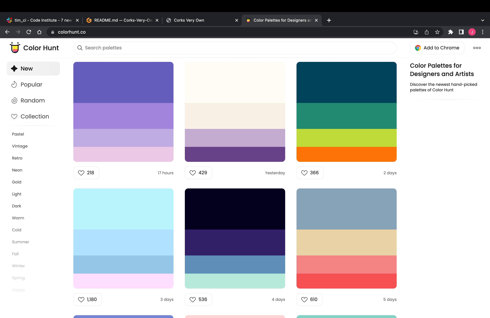
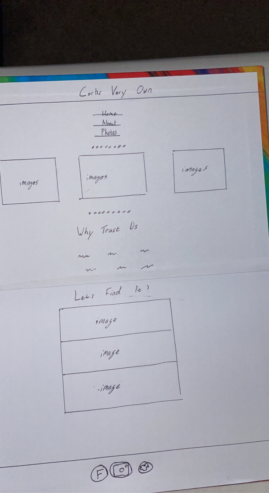
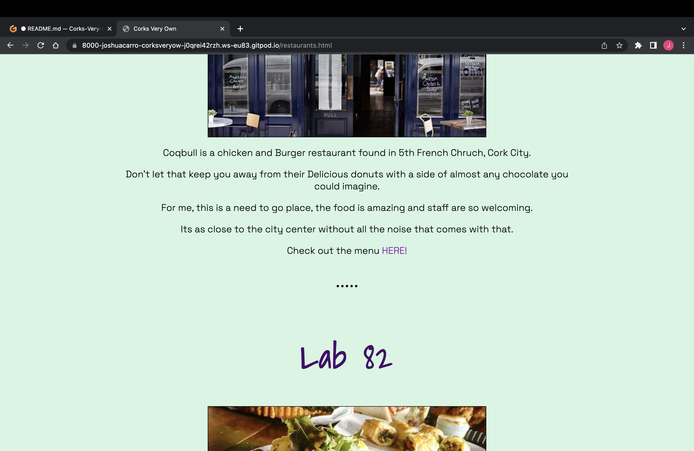
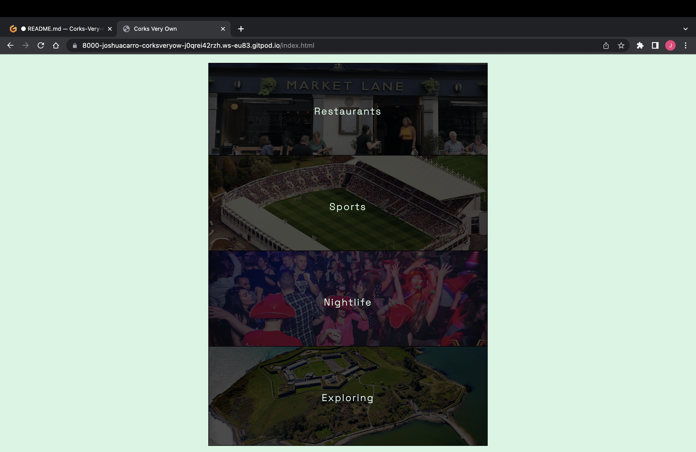

# CORKS VERY OWN


## UX

In this section, I will briefly explain your design processes.

### Colour Scheme

Explain your colours and the colour scheme.

- `#460C68` used for my H1, H2 text.
- `#D5F5E3` used for Body and H3 background.
- `#BCCEF8` used for Footer and Header Background.
- `#000000` used for Paragraphs text.

I used https://colorhunt.co/ to find my palette.





I've used CSS `:root` variables to easily update the global colour scheme by changing only one value, instead of everywhere in the CSS file.

```css
:root {
    /* P = Primary */
    --p-text: #460C68;
    --background: #D5F5E3;
}
```

### Typography


- [Shadows Into Light](https://fonts.google.com/specimen/Shadows+Into+Light) was used for the primary headers and titles.

- [Space Grotesk](https://fonts.google.com/specimen/Space+Grotesk?query=space+g) was used for all other secondary text.

- [Anton](https://fonts.google.com/specimen/Anton?query=anton) was used for the navigation text.

## User Stories


### New Site Users

- As a new site user, I would like to find a restaurant in Cork, so that I can eat in Cork.
- As a new site user, I would like to find sports activities in Cork, so that I can find fun places to play sports in Cork.
- As a new site user, I would like to find Cork's nightlife, to find pubs/ nightlife in Cork.
- As a new site user, I would like to find places to explore in Cork, so that I can explore Cork.
- As a new site user, I would like to find photos of Cork, so that I can see the best photos of Cork.

### Returning Site Users

- As a returning site user, I would like to find multiple different restaurants in Cork, so that I can .
- As a returning site user, I would like to find multiple different sports activites in Cork, so that I can so that I can find more places to play sports in Cork.
- As a returning site user, I would like to find multiple different places in Cork with nightlife, to find more pubs/ nightlife in Cork.
- As a returning site user, I would like to find multiple different places in Cork to explore, so that I can explore more places in Cork.
- As a returning site user, I would like to find multiple more photos and about the page, so that I can find out more about the page and more images.


## Wireframes


### Home Page Wireframes

| Size | Screenshot |
| --- | --- |
| Page |  |


## Features


### Existing Features

- **Link to menus/ external pages**

    - Link at end of sections to help Site Users find out more information about websites.
    - This is in the restaurants, sports, nightlife and exploring page at the end of most paragraphs!



- **Link to sections**

    - Link to four sections (restaurants, sports, nightlife and exploring) to other pages for ease of access.
    - At the bottom of Home/ index and About page.



- **Map**

    - Map on about page to show Cork only!
    - Under About Page section.


### Future Features


- Google maps view #1
    - Under every section I would like a google maps view of where exactly to find it.
- Contact page #2
    - Wanted to add a usable interactive contact page and add to the navigation.
- More sections on each page #3
    - Would like to continously add more restaurants and other sections to make it more inclusive to people in Urban areas.

## Tools & Technologies Used


- [HTML](https://en.wikipedia.org/wiki/HTML) used for the main site content.
- [CSS](https://en.wikipedia.org/wiki/CSS) used for the main site design and layout.
- [CSS :root variables](https://www.w3schools.com/css/css3_variables.asp) used for reusable styles throughout the site.
- [CSS Flexbox](https://www.w3schools.com/css/css3_flexbox.asp) and/or [CSS Grid](https://www.w3schools.com/css/css_grid.asp) used for an enhanced responsive layout.
- [Git](https://git-scm.com) used for version control. (`git add`, `git commit`, `git push`)
- [GitHub](https://github.com) used for secure online code storage.
- [GitHub Pages](https://pages.github.com) used for hosting the deployed front-end site.
- [Gitpod](https://gitpod.io) used as a cloud-based IDE for development.
- [Markdown Builder by Tim Nelson](https://traveltimn.github.io/readme-builder) used to help generate the Markdown files.

## Testing

For all testing, please refer to the [TESTING.md](TESTING.md) file.

## Deployment

The site was deployed to GitHub Pages. The steps to deploy are as follows:
- In the [GitHub repository](https://github.com/JoshuaCarroll1/Corks-Very-Own), navigate to the Settings tab 
- From the source section drop-down menu, select the **Main** Branch, then click "Save".
- The page will be automatically refreshed with a detailed ribbon display to indicate the successful deployment.

The live link can be found [here](https://joshuacarroll1.github.io/Corks-Very-Own)

### Local Deployment

This project can be cloned or forked in order to make a local copy on your own system.

#### Cloning

You can clone the repository by following these steps:

1. Go to the [GitHub repository](https://github.com/JoshuaCarroll1/Corks-Very-Own) 
2. Locate the Code button above the list of files and click it 
3. Select if you prefer to clone using HTTPS, SSH, or GitHub CLI and click the copy button to copy the URL to your clipboard
4. Open Git Bash or Terminal
5. Change the current working directory to the one where you want the cloned directory
6. In your IDE Terminal, type the following command to clone my repository:
	- `git clone https://github.com/JoshuaCarroll1/Corks-Very-Own.git`
7. Press Enter to create your local clone.

Alternatively, if using Gitpod, you can click below to create your own workspace using this repository.

[](https://gitpod.io/#https://github.com/JoshuaCarroll1/Corks-Very-Own)

Please note that in order to directly open the project in Gitpod, you need to have the browser extension installed.
A tutorial on how to do that can be found [here](https://www.gitpod.io/docs/configure/user-settings/browser-extension).

#### Forking

By forking the GitHub Repository, we make a copy of the original repository on our GitHub account to view and/or make changes without affecting the original owner's repository.
You can fork this repository by using the following steps:

1. Log in to GitHub and locate the [GitHub Repository](https://github.com/JoshuaCarroll1/Corks-Very-Own)
2. At the top of the Repository (not top of page) just above the "Settings" Button on the menu, locate the "Fork" Button.
3. Once clicked, you should now have a copy of the original repository in your own GitHub account!

### Local VS Deployment


## Credits


### Content


| Source | Location | Notes |
| --- | --- | --- |
| [Markdown Builder by Tim Nelson](https://traveltimn.github.io/readme-builder) | README and TESTING | tool to help generate the Markdown files |
| [Chris Beams](https://chris.beams.io/posts/git-commit) | version control | "How to Write a Git Commit Message" |
| [Udemy](https://www.udemy.com/course/the-complete-web-development-bootcamp/) | Tutorial Pages| Help with basic HTML/CSS |
| [W3Schools](https://www.w3schools.com/css/css3_flexbox.as) | entire site | How to use flexbox |
| [W3Schools](https://www.w3schools.com/css/css3_variables.asp) | entire site | how to use CSS :root variables |
| [Flexbox Froggy](https://flexboxfroggy.com/) | entire site | modern responsive layouts |

### Media


| Source | Location | Type | Notes |
| --- | --- | --- | --- |
| [Ireland](https://www.ireland.com/en-au/destinations/county/cork/cork-city/) | Home/Photos page | Image | Under main header |
| [EchoLive](https://www.echolive.ie/corknews/arid-40726149.html) | Home/Photos page | Image | Under main header |
| [TripAdvisor](https://media-cdn.tripadvisor.com/media/photo-m/1280/1c/b6/b3/82/shrimp-coriander-and.jpg) | Home/Photos page | Image | Under main header |
| [SportsForBusiness](https://sportforbusiness.com/wp-content/uploads/2019/08/Pairc-Ui-Chaoimh-2-1200x640.jpg) | Home/About/Photos page | Image | Bottom of Pages  |
| [Irelandbeforeyoudie](https://www.irelandbeforeyoudie.com/wp-content/uploads/2017/10/voodoo-1068x712.jpg) | Home/About/Photos page | Image | Bottom of Pages  |
| [SpikeIslandCork](https://www.spikeislandcork.ie/) | Home/About/Photos page | Image | Bottom of Pages  |
| [CoqbullCork](https://www.coqbull.com/wp-content/uploads/2020/11/COQBULL-Cork-800x533.jpg) | Restaurants/Photos page | Image | Top of Restaurant Page  |
| [CoqbullCork](https://coqbullcork.ie/wp-content/uploads/2020/06/cb-burger-cians-shot-800x600.jpg) | Restaurants/Photos page | Image | Top of Restaurant Page  |
| [CoqbullCork](https://homehak.com/wp-content/uploads/2020/09/view-of-cafe-from-the.jpg) | Restaurants/Photos page | Image | Top of Restaurant Page  |
| [homehak](https://encrypted-tbn0.gstatic.com/images?q=tbn:ANd9GcTm3WaK8qiBJzvovcHZ8Cp1bZo6rzATQBKAuQ&usqp=CAU) | Restaurants/Photos page | Image | middle of Restaurant Page  |
| [homehak](https://homehak.com/wp-content/uploads/2020/09/view-of-cafe-from-the.jpg) | Restaurants/Photos page | Image | middle of Restaurant Page  |
| [dineatdome](https://dineatdome.com/wp-content/uploads/2020/07/33239203_436802053412309_4722413402054459392_o-1034x800.jpg) | Restaurants/Photos page | Image | bottom of Restaurant Page  |
| [Deliveroo](https://deliveroo.ie/menu/cork/cork/tequila-jacks-mexican-restaurant) | Restaurants/Photos page | Image | bottom of Restaurant Page  |
| [whattodoinireland.com](https://whattodoinireland.com/wp-content/uploads/2021/04/ballyhass-aqua-4.jpg) |Sports/Photos page | Image | Top of Sports Page  |
| [tripadvisor](https://dynamic-media-cdn.tripadvisor.com/media/photo-o/10/9c/5d/d2/irelands-newest-inflatable.jpg?w=1800&h=1400&s=1) | Sports/Photos page | Image | Top of Sports Page  |
| [salesiancollege](https://salesiancollege.ie/wp-content/uploads/2022/03/5042_20220324152049-1.jpeg) | Sports/Photos page | Image | Top of Sports Page  |
| [groupon](https://img.grouponcdn.com/deal/RJwhhAcvifhagFUW7C/Td-2048x1229/v1/c870x524.webp) | Sports/Photos page | Image | Middle of Sports Page  |
| [yourdaysout](https://www.yourdaysout.ie/uploads//articleimages/ce/thumbce194f32c7be6d0bd346dfefb06af70b.jpg) | Sports/Photos page | Image | Middle of Sports Page  |
| [corkbeo](https://i2-prod.corkbeo.ie/news/local-news/article16078982.ece/ALTERNATES/s810/1_Screen-Shot-2019-04-04-at-160805.png) | Sports/Photos page | Image | Middle of Sports Page  |
| [perksfunfair](https://www.perksfunfair.com/wp-content/uploads/2022/05/Perks-Family-Entertainment-Centre-Youghal-play-to-win-prizes-games-18.jpg) | Sports/Photos page | Image | Middle of Sports Page  |
| [perksfunfair](https://www.perksfunfair.com/wp-content/uploads/2022/05/bowling-perks-entertainment-centre-youghal-co-cork-ireland-5.jpg) | Sports/Photos page | Image | Middle of Sports Page  |
| [dayoutwiththekids](https://res.dayoutwiththekids.co.uk/image/upload/w_1500,h_420,q_85,c_fill,g_auto/w_800,h_450,q_75,c_fill/v1594134283/attractions/p/perks-entertainment-centre-aa70c4ff/36990-perks-entertainment-centre-youghal-01.webp) | Sports/Photos page | Image | Middle of Sports Page  |
| [reardens](https://www.reardens.com/wp-content/uploads/2021/02/DSC_0003-scaled.jpg) | Nightlife/Photos page | Image | top of Nightlife Page  |
| [reardens](https://www.reardens.com/wp-content/uploads/2021/02/Reardens-Inter-25-4-17-292-2-scaled.jpg) | Nightlife/Photos page | Image | top of Nightlife Page  |
| [restaurantguru](https://10619-2.s.cdn12.com/rests/small/w320/h220/109_507466834.jpg) | Nightlife/Photos page | Image | middle of Nightlife page  |
| [irelandbeforeyoudie](https://www.irelandbeforeyoudie.com/wp-content/uploads/2017/10/voodoo-1920x1280.jpg) | Nightlife/Photos page | Image | middle of Nightlife Page  |
| [corkbeo](https://i2-prod.corkbeo.ie/news/local-news/article20799284.ece/ALTERNATES/s810/1_Screen-Shot-2021-06-12-at-095608.png) | Nightlife/Photos page | Image | bottom of Nightlife Page  |
| [corkbeo](https://i2-prod.corkbeo.ie/news/local-news/article20799297.ece/ALTERNATES/s615b/0_Screen-Shot-2021-06-12-at-100010.png) | Nightlife/Photos page | Image | bottom of Nightlife Page  |

| [nohomejustroam](https://nohomejustroam.com/wp-content/uploads/2017/09/Blarney-Castle-waterfall-680x453.jpg) | Exploring/Photos page | Image | top of Exploring Page  |
| [wikimedia](https://upload.wikimedia.org/wikipedia/commons/4/43/Blarney_Castle-02-2017-gje.jpg) | Exploring/Photos page | Image | top of Exploring Page  |
| [wikipedia](https://upload.wikimedia.org/wikipedia/commons/4/41/The_Blarney_Stone.jpg) | Exploring/Photos page | Image | top of Exploring Page  |
| [discoverireland](https://assets-eu-01.kc-usercontent.com/aa24ba70-9a12-01ae-259b-7ef588a0b2ef/ed14da92-dc0c-4837-9273-af4599202023/header-ballycotton-island.jpg?w=1332&q=66&h=750&fit=crop&fm=webp) | Exploring/Photos page | Image | middle of Exploring Page  |
| [cork-guide](https://www.cork-guide.ie/assets/headers/ballycotton_walk.jpg) | Exploring/Photos page | Image | media of Exploring Page  |
| [tripadvisor](https://dynamic-media-cdn.tripadvisor.com/media/photo-o/0f/37/0e/bc/photo1jpg.jpg?w=1800&h=-1&s=1) | Exploring/Photos page | Image | middle of Exploring Page  |
| [irishexaminer](https://www.irishexaminer.com/cms_media/module_img/6376/3188183_6_articlemedium_QUEEN_20IRL_20ENGLISH_20MARKET_20MX9.jpg) | Exploring/Photos page | Image | bottom of Exploring Page  |
| [yaycork](https://www.yaycork.ie/wp-content/uploads/2020/03/is-the-english-market-open--scaled-e1585213901217.jpg) | Exploring/Photos page | Image | bottom of Exploring Page  |
| [tripsavvy](https://www.tripsavvy.com/thmb/En4gOSRHgFos375Q12fkRXpeQd4=/750x0/filters:no_upscale():max_bytes(150000):strip_icc():format(webp)/GettyImages-157727730-5c6469c946e0fb00017dd917.jpg) | Exploring/Photos page | Image | bottom of Exploring Page  |


## Acknowledgements

- I would like to thank my Code Institute mentor, [Tim Nelson](https://github.com/TravelTimN) for their support throughout the development of this project.
- I would like to thank the [Code Institute](https://codeinstitute.net) tutor team for their assistance with troubleshooting and debugging some project issues.
- I would like to thank the [Code Institute Slack community](https://code-institute-room.slack.com) for keeping the slack channel up to date with useful tips.
- I would like to thank my parents, for believing in me, and allowing me to make this transition into software development.
- I would like to thank my girlfriend, for supporting me in my career development change towards becoming a software developer and motivating me to keep on top of study daily.
