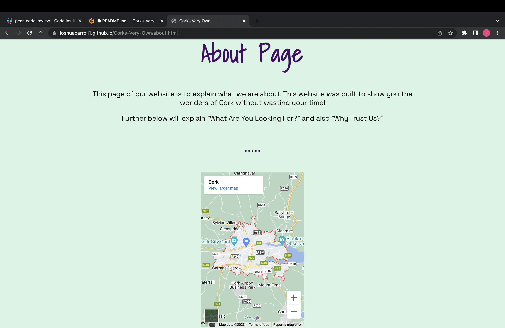

# Testing

Return back to the [README.md](README.md) file.

## Code Validation

**IMPORTANT**: You must provide a screenshot for each file you validate.

**PRO TIP**: Always validate the live site pages, not your local code. There could be subtle/hidden differences.

### HTML

I have used the recommended [HTML W3C Validator](https://validator.w3.org) to validate all of my HTML files.

- https://validator.w3.org/nu/?doc=https%3A%2F%2FJoshuaCarroll1.github.io%2FCorks-Very-Own%2Findex.html

| Page | W3C URL | Screenshot | Notes |
| --- | --- | --- | --- |
| Home | [W3C](https://validator.w3.org/nu/?doc=https%3A%2F%2Fjoshuacarroll1.github.io%2FCorks-Very-Own%2Findex.html) |  | Section lacks header h2-h6 warning |
| About | [W3C](https://validator.w3.org/nu/?doc=https%3A%2F%2Fjoshuacarroll1.github.io%2FCorks-Very-Own%2Fabout.html) |  |  Section lacks header h2-h6 warning |
| Photos | [W3C](https://validator.w3.org/nu/?doc=https%3A%2F%2Fjoshuacarroll1.github.io%2FCorks-Very-Own%2Fphotos.html) |  | Pass: No Errors |
| Restaurants | [W3C](https://validator.w3.org/nu/?doc=https%3A%2F%2Fjoshuacarroll1.github.io%2FCorks-Very-Own%2Frestaurants.html) |  | Section lacks heading. Consider using h2-h6 |
| Sports | [W3C](https://validator.w3.org/nu/?doc=https%3A%2F%2Fjoshuacarroll1.github.io%2FCorks-Very-Own%2Fsports.html) |  |  Section lacks heading. Consider using h2-h6 |
| Nightlife | [W3C](https://validator.w3.org/nu/?doc=https%3A%2F%2Fjoshuacarroll1.github.io%2FCorks-Very-Own%2Fnightlife.html) |  | Section lacks heading. Consider using h2-h6 |
| Exploring | [W3C](https://validator.w3.org/nu/?doc=https%3A%2F%2Fjoshuacarroll1.github.io%2FCorks-Very-Own%2Fexploring.html) |  | Section lacks heading. Consider using h2-h6 |

### CSS

I have used the recommended [CSS Jigsaw Validator](https://jigsaw.w3.org/css-validator) to validate all of my CSS files.

- (*recommended*) If you are using the live deployed site, use this link: https://jigsaw.w3.org/css-validator/#validate_by_uri

- https://jigsaw.w3.org/css-validator/validator?uri=https%3A%2F%2FJoshuaCarroll1.github.io%2FCorks-Very-Own

| File | Jigsaw URL | Screenshot | Notes |
| --- | --- | --- | --- |
| style.css | [Jigsaw](https://jigsaw.w3.org/css-validator/validator?uri=https%3A%2F%2Fjoshuacarroll1.github.io%2FCorks-Very-Own%2F&profile=css3svg&usermedium=all&warning=1&vextwarning=&lang=en) |  | Pass: No Errors |
| checkout.css | n/a |  | Pass: No Errors |

## Browser Compatibility

I've tested my deployed project on multiple browsers to check for compatibility issues.

| Browser | Screenshot | Notes |
| --- | --- | --- |
| Chrome |  | Works as expected |
| Safari |  | Minor CSS differences |
| Edge |  | Works as expected |
| Brave |  | Works as expected |

## Responsiveness

I've tested my deployed project on multiple devices to check for responsiveness issues.

| Device | Screenshot | Notes |
| --- | --- | --- |
| Mobile (DevTools) |  | Works as expected |
| Tablet (DevTools) |  | Works as expected |
| Desktop |  | Works as expected |
| Macbook Air M2 |  | Works as expected |
| iPhone 12|  | Works as expected |

## Lighthouse Audit

I've tested my deployed project using the Lighthouse Audit tool to check for any major issues.

| Page | Size | Screenshot | Notes |
| --- | --- | --- | --- |
| Home | Mobile |  | Some minor warnings |
| Home | Desktop |  | Few warnings |
| About | Mobile |  | Some minor warnings |
| About | Desktop |  | Few warnings |
| Photos| Mobile |  | Slow response time due to large images |
| Photos | Desktop |  | Slow response time due to large images |
| Restaurants| Mobile |  | Slow response time due to large images |
| Restaurants| Desktop |  | Slow response time due to large images |
| Sports| Mobile |  | Slow response time due to large images |
| Sports| Desktop |  | Slow response time due to large images |
| Nightlife| Mobile |  | Slow response time due to large images |
| Nightlife| Desktop |  | Slow response time due to large images |
| Exploring| Mobile |  | Slow response time due to large images |
| Exploring| Desktop |  | Slow response time due to large images |

## User Story Testing

Testing user stories is actually quite simple, once you've already got the stories defined on your README.

Most of your project's **features** should already align with the **user stories**,
so this should as simple as creating a table with the user story, matching with the re-used screenshot
from the respective feature.

| User Story | Screenshot |
| --- | --- |
| As a new site user, I would like to find a restaurant in Cork, so that I can eat in Cork. |  |
| As a new site user, I would like to find sports activities in Cork, so that I can find fun places to play sports in Cork. |  |
| As a new site user, I would like to find Cork's nightlife, so that I can to find pubs/ nightlife in Cork. |  |
| As a returning site user, I would like to ____________, so that I can ____________. |  |
| As a returning site user, I would like to ____________, so that I can ____________. |  |
| As a returning site user, I would like to ____________, so that I can ____________. |  |

## Bugs

It's very important to document any bugs you've discovered while developing the project.
Make sure to include any necessary steps you've implemented to fix the bug(s) as well.

For JavaScript and Python applications, it's best to screenshot the errors to include them as well.

**PRO TIP**: screenshots of bugs are extremely helpful, and go a long way!

- JS Uncaught ReferenceError: `foobar` is undefined/not defined

    

    - To fix this, I _____________________.

- JS `'let'` or `'const'` or `'template literal syntax'` or `'arrow function syntax (=>)'` is available in ES6 (use `'esversion: 11'`) or Mozilla JS extensions (use moz).

    

    - To fix this, I _____________________.

- Python `'ModuleNotFoundError'` when trying to import module from imported package

    

    - To fix this, I _____________________.

- Django `TemplateDoesNotExist` at /appname/path appname/template_name.html

    

    - To fix this, I _____________________.

- Python `E501 line too long` (93 > 79 characters)

    

    - To fix this, I _____________________.

### GitHub **Issues**

An improved way to manage bugs is to use the built-in **Issues** tracker on your GitHub repository.
To access your Issues, click on the "Issues" tab at the top of your repository.
Alternatively, use this link: https://github.com/JoshuaCarroll1/Corks-Very-Own/issues

If using the Issues tracker for your bug management, you can simplify the documentation process.
Issues allow you to directly paste screenshots into the issue without having to first save the screenshot locally,
then uploading into your project.

You can add labels to your issues (`bug`), assign yourself as the owner, and add comments/updates as you progress with fixing the issue(s).

Once you've sorted the issue, you should then "Close" it.

When showcasing your bug tracking for assessment, you can use the following format:

**Fixed Bugs**

All previously closed/fixed bugs can be tracked [here](https://github.com/JoshuaCarroll1/Corks-Very-Own/issues?q=is%3Aissue+is%3Aclosed).

| Bug | Status |
| --- | --- |
| [JS Uncaught ReferenceError: `foobar` is undefined/not defined](https://github.com/JoshuaCarroll1/Corks-Very-Own/issues/1) | Closed |
| [Python `'ModuleNotFoundError'` when trying to import module from imported package](https://github.com/JoshuaCarroll1/Corks-Very-Own/issues/2) | Closed |
| [Django `TemplateDoesNotExist` at /appname/path appname/template_name.html](https://github.com/JoshuaCarroll1/Corks-Very-Own/issues/3) | Closed |

**Open Issues**

Any remaining open issues can be tracked [here](https://github.com/JoshuaCarroll1/Corks-Very-Own/issues).

| Bug | Status |
| --- | --- |
| [JS `'let'` or `'const'` or `'template literal syntax'` or `'arrow function syntax (=>)'` is available in ES6 (use `'esversion: 11'`) or Mozilla JS extensions (use moz).](https://github.com/JoshuaCarroll1/Corks-Very-Own/issues/4) | Open |
| [Python `E501 line too long` (93 > 79 characters)](https://github.com/JoshuaCarroll1/Corks-Very-Own/issues/5) | Open |

## Unfixed Bugs

There are no remaining bugs that I am aware of.
